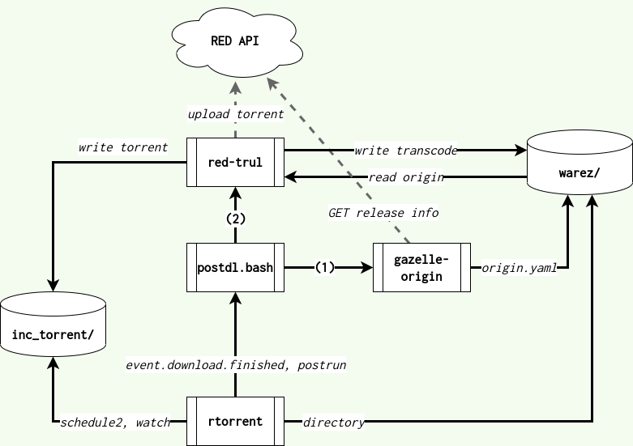

# red-trul: RED TRanscode-UpLoad
This little utility 
- Takes one or more directories of as input. Inputs without any 
  [origin.yml](https://github.com/x1ppy/gazelle-origin) file or that are not flac
  are ignored.
- Detects the edition group at RED and transcodes any missing formats FLAC (for 24-bit lossess inputs), V0 and 320.
- Creates the torrent files and uploads to RED. 

*The tool tries to not break any rules, for example by avoiding inputs with
missing or bad tagging, but the user of this tool is liable for her own
uploads.*


## Installing

You need:
- nodejs
- flac
- lame
- sox
- ffmpeg
- git

```bash
git clone https://github.com/lfence/red-trul && cd ./red-trul
# clones flac2mp3 sub repo
git submodule update --init --recursive .
npm install
```

#### Issue with id3v2 tags and foreign characters

Remove unsync behavior for ancient (pre-id3) mp3 players. This fixes a bug with
special characters in tags by adding the line.

```
sed -i '/use MP3::Tag;/aMP3::Tag->config(id3v23_unsync => 0);' flac2mp3/flac2mp3.pl
```

## Usage

```
Usage: trul.js [OPTIONS] flac-dir [flac-dir2, [...]]

Options:
      --version        Show version number                             [boolean]
      --api-key        API token with Torrents capability. Env definable as
                       RED_API_KEY
  -o, --torrent-dir    Where to output torrent files              [default: "."]
  -a, --announce       Specify the full announce URL found on
                       https://redacted.ch/upload.php
  -t, --transcode-dir  Output directory of transcodes
      --no-v0          Don't transcode into V0                         [boolean]
      --no-320         Don't transcode into 320                        [boolean]
      --verbose        Print more                                      [boolean]
  -h, --help           Show help                                       [boolean]
```

### Example

```
./trul.js --api-key xxxxxxxx.xxxxxxxxxxxxxxxxxxxxxxxxxxxxxxxx "Music/Artist - Album (2024) WEB FLAC" 
[-] using announce: https://flacsfor.me/xxxxxxxxxxxxxxxxxxxxxxxxxxxxxxxx/announce
[-] fetch torrent info...
[-] analyze filelist...
[-] ffprobe 18 files...
[+] Required tags are present, would transcode this
[-] permalink: https://redacted.ch/torrents.php?torrentid=4534554
[-] grouplink: https://redacted.ch/torrents.php?id=2129651
[-] fetch torrentgroup...
[-] Transcoding /home/me/Music/Artist - Album (2024) - WEB V0
>> [3132334] Using 4 transcoding processes.

[-] Transcoding /home/me/Music/Artist - Album (2024) - WEB 320
>> [3132410] Using 4 transcoding processes.

[-] Uploading...
[-] Write torrents...
[*] Done!
```

## Advanced: Toolchain

Use `flock.bash` to avoid running multiple instances of red-trul, but queue up
jobs instead.

red-trul is designed to run non-interactively.



Have rtorrent do two things:
 - Run a `postdl.bash` script that runs `gazelle-origin` and `trul` (via `flock.bash`).
 - Monitor a directory for new torrents to add.

The rtorrent.rc setup is similar to
[gazelle-origin](https://github.com/x1ppy/gazelle-origin)'s.

```
# rtorrent.rc excerpt

method.insert = cfg.basedir,  private|const|string, (cat,"/home/lfen/rtorrent/")
method.insert = cfg.watch,    private|const|string, (cat,(cfg.basedir),"inc_torrent/")

schedule2 = watch_directory_red, 10, 10, ((load.start_verbose, (cat, (cfg.watch), "*.torrent"), "d.delete_tied="))
method.set_key = event.download.finished,postrun,"execute2={~/postdl.bash,$d.base_path=,$d.hash=,$session.path=}"
```

The `postdl.bash` can look like so

```bash
#!/bin/bash
export RED_API_KEY=...
export ORIGIN_TRACKER=red

BASE_PATH=$1
INFO_HASH=$2
SESSION_PATH=$3

TRUL_PATH=/some/path/red-trul/flock.bash
GAZELLEORIGIN_PATH=/some/path
TRANSCODE_DIR=/home/lfen/my_music
# NOTE this matches with .rtorrent.rc watch dir
TORRENT_DIR=/home/lfen/rtorrent/watch_red
ANNOUNCE_URL=...

if ! grep flacsfor.me "$SESSION_PATH/$INFO_HASH.torrent"; then
    # Not a RED torrent.
    exit 0
fi

$GAZELLEORIGIN_PATH -o "$BASE_PATH/origin.yaml" $INFO_HASH

FORMAT=$(grep -Po 'Format: *\K.*' "$BASE_PATH/origin.yaml")
if [[ $FORMAT != "FLAC" ]]; then
  # not a FLAC release, can not transcode
  exit 0
fi

$TRUL_PATH --torrent-dir=$TORRENT_DIR "$BASE_PATH" &
```

